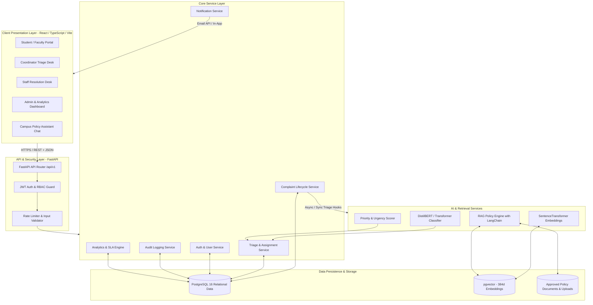
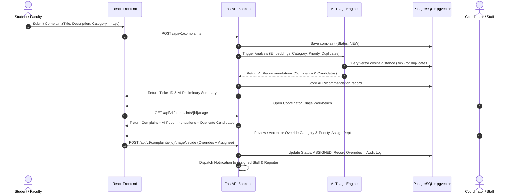
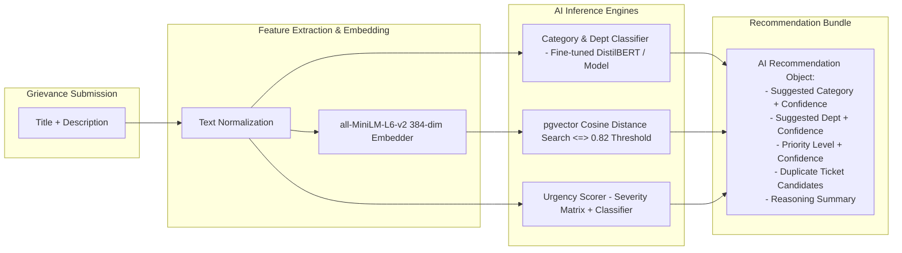

# FixMyCampus AI: Project Architecture & Technical Specification

**Project Title:** FixMyCampus AI: An Intelligent Campus Grievance Classification, Deduplication and Resolution Platform  
**Domain:** Full-Stack Web Development & Applied Generative AI  
**Author / Engineering Lead:** Senior Full-Stack & AI Systems Architect  
**Document Version:** 1.0.0  
**Target Environment:** Python 3.12, FastAPI, PostgreSQL (pgvector), React 18+ (TypeScript, Vite, Tailwind CSS, shadcn/ui)

---

## 1. Executive Summary & Core Engineering Principles

### 1.1 Purpose
FixMyCampus AI is a production-grade campus grievance management platform designed for universities and higher-education institutions. It enables students, faculty, and staff to report campus issues (infrastructure, IT, sanitation, plumbing, electrical, civil maintenance, academic facilities) and empowers campus administration (staff, coordinators, administrators) to triage, assign, track, resolve, and audit grievances with end-to-end transparency.

### 1.2 Core Architectural Principles

1. **Human-in-the-Loop AI with Explicit Explainability**:
   AI models generate suggestions and recommendations (category, department, priority, duplicate likelihood), but **never execute irreversible actions automatically** (e.g., auto-closing or auto-merging tickets). Authorized staff must review, verify, accept, or override AI suggestions.
2. **Fail-Soft Reliability**:
   The platform's core ticket lifecycle operates independently of AI services. If external LLM APIs, embedding services, or model inference servers experience downtime, grievance creation, routing, and resolution proceed smoothly without disruption.
3. **Zero-Trust Backend Authorization**:
   The frontend is treated as an untrusted presentation layer. Every API endpoint enforces strict Role-Based Access Control (RBAC) and ownership policies via backend FastAPI dependency injection.
4. **Complete Auditability**:
   Every lifecycle transition, assignment change, SLA milestone, AI recommendation acceptance, and staff override is permanently recorded in an immutable audit log with user metadata and timestamps.
5. **Data Privacy & Secure File Handling**:
   Strict validation of attachments (MIME type verification, size constraints, magic byte checks), password hashing using `bcrypt`/`argon2`, and parameterization of all database queries to prevent SQL injection and PII exposure.

---

## 2. System Architecture



### 2.1 Request & Triage Lifecycle



---

## 3. Directory Structure

The project is structured as a clean, production-ready monorepo separating frontend, backend, AI pipelines, and documentation:

```
FixMyCampus/
├── .github/
│   └── workflows/
│       ├── backend-ci.yml
│       └── frontend-ci.yml
├── backend/
│   ├── alembic/
│   │   ├── versions/
│   │   └── env.py
│   ├── app/
│   │   ├── api/
│   │   │   ├── deps.py                 # RBAC, DB session, current_user dependencies
│   │   │   └── v1/
│   │   │       ├── api.py              # Root API router v1
│   │   │       ├── auth.py             # Login, register, token refresh
│   │   │       ├── users.py            # User management, profile
│   │   │       ├── departments.py      # Department CRUD & member listings
│   │   │       ├── complaints.py       # Complaint submission, listing, detail
│   │   │       ├── triage.py           # Coordinator AI triage verification & overrides
│   │   │       ├── resolution.py       # Staff status progression, resolution, reopen
│   │   │       ├── rag.py              # Campus policy assistant with source citations
│   │   │       ├── analytics.py        # SLA, resolution trends, category stats
│   │   │       └── audit.py            # Audit log inspection
│   │   ├── core/
│   │   │   ├── config.py               # Pydantic Settings & environment variables
│   │   │   ├── database.py             # SQLAlchemy Async Engine & SessionMaker
│   │   │   ├── security.py             # Password hashing, JWT encode/decode
│   │   │   └── exceptions.py           # Custom domain exception handlers
│   │   ├── models/
│   │   │   ├── base.py                 # Declarative Base & common timestamps
│   │   │   ├── user.py                 # User model & Role enum
│   │   │   ├── department.py           # Department model
│   │   │   ├── complaint.py            # Complaint & Status History models
│   │   │   ├── ai_recommendation.py    # AI suggestions & override tracking
│   │   │   ├── feedback.py             # User feedback & rating model
│   │   │   ├── audit.py                # Immutable audit log model
│   │   │   ├── policy_document.py      # Campus policy metadata & vector chunks
│   │   │   └── notification.py         # Notification records
│   │   ├── schemas/
│   │   │   ├── auth.py                 # Token schemas, Login, Register
│   │   │   ├── user.py                 # UserRead, UserCreate, UserUpdate
│   │   │   ├── department.py           # Department schemas
│   │   │   ├── complaint.py            # ComplaintCreate, ComplaintRead, Filter
│   │   │   ├── triage.py               # AI recommendation & override schemas
│   │   │   ├── rag.py                  # Policy query & citation schemas
│   │   │   ├── analytics.py            # Chart and KPI aggregations
│   │   │   └── audit.py                # Audit log schemas
│   │   ├── services/
│   │   │   ├── auth_service.py         # Authentication logic
│   │   │   ├── complaint_service.py    # Complaint lifecycle state machine
│   │   │   ├── triage_service.py       # Verification & override logic
│   │   │   ├── audit_service.py        # Centralized audit logger
│   │   │   ├── notification_service.py # Email/In-app dispatcher
│   │   │   └── analytics_service.py    # SQL aggregation metrics
│   │   ├── ai/
│   │   │   ├── classifier.py           # DistilBERT/sklearn complaint category classifier
│   │   │   ├── deduplicator.py         # SentenceTransformer + pgvector similarity
│   │   │   ├── priority_engine.py      # Urgency assessment rules + classifier
│   │   │   ├── rag_engine.py           # LangChain RAG with citation grounding
│   │   │   └── document_indexer.py     # PDF/Text ingestion into pgvector
│   │   └── main.py                     # FastAPI application factory & middleware
│   ├── tests/
│   │   ├── conftest.py                 # Pytest fixtures, test DB, mock clients
│   │   ├── test_auth.py
│   │   ├── test_complaints.py
│   │   ├── test_triage.py
│   │   ├── test_ai_services.py
│   │   └── test_rag.py
│   ├── alembic.ini
│   ├── Dockerfile
│   ├── pyproject.toml
│   └── requirements.txt
├── frontend/
│   ├── public/
│   │   └── favicon.ico
│   ├── src/
│   │   ├── assets/
│   │   ├── components/
│   │   │   ├── layout/                 # Navbar, Sidebar, AppLayout, Footer
│   │   │   ├── ui/                     # shadcn/ui components (Button, Dialog, etc.)
│   │   │   ├── common/                 # StatusBadge, PriorityBadge, RoleGuard
│   │   │   └── rag/                    # Floating Campus Policy Chatbot Drawer
│   │   ├── features/
│   │   │   ├── auth/                   # Login, Register, Profile pages & hooks
│   │   │   ├── complaints/             # Submission form, ticket lists, detail view
│   │   │   ├── triage/                 # Coordinator AI review & override workbench
│   │   │   ├── staff/                  # Staff assigned queue, update status, resolve
│   │   │   ├── analytics/              # Recharts SLA metrics, heatmaps, breakdowns
│   │   │   └── audit/                  # Audit trail explorer
│   │   ├── hooks/                      # useAuth, useComplaints, useRAG, useDebounce
│   │   ├── lib/                        # Axios client, QueryClient, utils, constants
│   │   ├── types/                      # TypeScript definitions for all domain models
│   │   ├── router.tsx                  # React Router 6 configuration
│   │   ├── App.tsx
│   │   ├── main.tsx
│   │   └── index.css                   # Tailwind CSS tokens & theme variables
│   ├── tests/
│   │   ├── unit/
│   │   └── e2e/
│   ├── index.html
│   ├── package.json
│   ├── tsconfig.json
│   ├── tailwind.config.js
│   ├── postcss.config.js
│   └── vite.config.ts
├── data/
│   ├── seed_data/                      # Synthetic complaint datasets
│   └── policy_docs/                    # Approved university policy PDFs/Markdown
├── docker-compose.yml
├── .env.example
├── .gitignore
├── README.md
└── PROJECT_ARCHITECTURE.md
```

---

## 4. Module & Service Specifications

### 4.1 Backend Domain Modules

| Module Name | Purpose | Key Responsibilities |
| :--- | :--- | :--- |
| **`Core & Security`** | Framework Foundation | Configuration management, DB engine pooling, JWT generation/validation, password hashing, standard error responses. |
| **`Auth & RBAC`** | Identity Management | User registration, login, token refresh, password resets, role-based route protection. |
| **`Complaints Engine`** | Core Ticket Domain | Complaint submission, attachment uploads, validation, ticket numbering (`TICK-2026-XXXX`), state transitions. |
| **`Triage & Review`** | Human-in-the-Loop AI | Fetches AI recommendations, displays comparison diffs to coordinators, commits department assignments and overrides. |
| **`Resolution & Feedback`** | Remediation Workflow | Status progression (`IN_PROGRESS` $\to$ `RESOLVED`), resolution notes, student rating/feedback, reopen request handling. |
| **`AI Triage Engine`** | Intelligent Analysis | Category prediction, priority assessment, semantic vector duplicate search, confidence score calculation. |
| **`RAG Policy Assistant`** | Knowledge Retrieval | Semantic chunk search over verified campus regulations, prompt-grounded LLM answers with page/section citations. |
| **`Audit Logging`** | System Governance | Immutable records of every status change, department re-assignment, role change, and AI recommendation override. |
| **`Analytics & SLA`** | Operational Insights | Aggregates average resolution time, SLA breach rates, category distribution, coordinator workload, AI acceptance rate. |

---

## 5. Database Entities & Schema Design

### 5.1 Entity-Relationship Diagram

```mermaid
erDiagram
    USERS ||--o{ COMPLAINTS : "reports"
    USERS ||--o{ COMPLAINT_STATUS_HISTORY : "changes status"
    USERS ||--o{ COMPLAINT_FEEDBACK : "provides"
    USERS ||--o{ AUDIT_LOGS : "triggers"
    DEPARTMENTS ||--o{ USERS : "belongs to"
    DEPARTMENTS ||--o{ COMPLAINTS : "assigned to"
    
    COMPLAINTS ||--|| AI_RECOMMENDATIONS : "has"
    COMPLAINTS ||--o{ COMPLAINT_STATUS_HISTORY : "tracks"
    COMPLAINTS ||--o| COMPLAINT_FEEDBACK : "receives"
    COMPLAINTS ||--o{ NOTIFICATIONS : "generates"
    
    POLICY_DOCUMENTS ||--o{ POLICY_EMBEDDINGS : "contains"

    USERS {
        uuid id PK
        string email UK
        string password_hash
        string full_name
        enum role "STUDENT, FACULTY, STAFF, COORDINATOR, ADMIN"
        uuid department_id FK "nullable"
        boolean is_active
        datetime created_at
        datetime updated_at
    }

    DEPARTMENTS {
        uuid id PK
        string name UK
        string code UK
        string description
        uuid head_user_id FK "nullable"
        boolean is_active
        datetime created_at
    }

    COMPLAINTS {
        uuid id PK
        string ticket_number UK
        uuid reporter_id FK
        string title
        text description
        string location
        enum category "IT_NETWORK, ELECTRICAL, SANITATION, PLUMBING, CLASSROOM_EQUIPMENT, CIVIL_MAINTENANCE, ACADEMIC_FACILITIES, OTHER"
        uuid department_id FK "nullable"
        enum priority "LOW, MEDIUM, HIGH, CRITICAL"
        enum status "NEW, UNDER_REVIEW, ASSIGNED, IN_PROGRESS, RESOLVED, REOPENED, CLOSED"
        jsonb attachments "array of urls/metadata"
        vector embedding_384 "vector(384)"
        datetime sla_due_at
        datetime resolved_at
        datetime created_at
        datetime updated_at
    }

    AI_RECOMMENDATIONS {
        uuid id PK
        uuid complaint_id FK UK
        string suggested_category
        float category_confidence
        uuid suggested_department_id FK "nullable"
        float department_confidence
        enum suggested_priority "LOW, MEDIUM, HIGH, CRITICAL"
        float priority_confidence
        jsonb duplicate_candidates "list of {complaint_id, score, ticket_number, title}"
        text reasoning_summary
        boolean is_accepted
        jsonb overridden_fields "details of coordinator changes"
        datetime reviewed_at
        uuid reviewed_by_id FK "nullable"
        datetime created_at
    }

    COMPLAINT_STATUS_HISTORY {
        uuid id PK
        uuid complaint_id FK
        enum from_status "nullable"
        enum to_status
        uuid changed_by_id FK
        text remarks
        datetime created_at
    }

    COMPLAINT_FEEDBACK {
        uuid id PK
        uuid complaint_id FK UK
        int rating "1 to 5"
        text comments
        uuid user_id FK
        datetime created_at
    }

    AUDIT_LOGS {
        uuid id PK
        uuid user_id FK "nullable"
        string action "e.g., TICKET_CREATE, TRIAGE_OVERRIDE, STATUS_CHANGE"
        string entity_type "COMPLAINT, USER, DEPARTMENT"
        uuid entity_id
        jsonb old_values
        jsonb new_values
        string ip_address
        datetime created_at
    }

    POLICY_DOCUMENTS {
        uuid id PK
        string title
        string category
        string file_path
        string checksum
        uuid uploaded_by_id FK
        datetime created_at
    }

    POLICY_EMBEDDINGS {
        uuid id PK
        uuid document_id FK
        int chunk_index
        text chunk_text
        vector embedding_384 "vector(384)"
        jsonb metadata "page, section, headings"
        datetime created_at
    }

    NOTIFICATIONS {
        uuid id PK
        uuid user_id FK
        uuid complaint_id FK "nullable"
        string title
        text message
        string type "STATUS_UPDATE, SLA_WARNING, ASSIGNMENT, FEEDBACK_REQ"
        boolean is_read
        datetime created_at
    }
```

---

## 6. API Boundaries & Interface Specifications

All endpoints are prefixed with `/api/v1` and return standardized JSON responses.

### 6.1 Authentication & User Management
- `POST /api/v1/auth/register` $\to$ Register student/faculty with institutional email.
- `POST /api/v1/auth/login` $\to$ Authenticate and receive JWT access and refresh tokens.
- `POST /api/v1/auth/refresh` $\to$ Rotate expired access tokens.
- `GET /api/v1/auth/me` $\to$ Retrieve authenticated user profile and permissions.
- `GET /api/v1/users` $\to$ Admin list users with filters (role, department, status).
- `PATCH /api/v1/users/{id}/role` $\to$ Admin update user role or department assignment.

### 6.2 Department Management
- `GET /api/v1/departments` $\to$ List active campus departments.
- `POST /api/v1/departments` $\to$ Admin create department.
- `PUT /api/v1/departments/{id}` $\to$ Admin update department details / department head.

### 6.3 Complaint Lifecycle
- `POST /api/v1/complaints` $\to$ Submit new complaint (with optional image attachment).
- `GET /api/v1/complaints` $\to$ List complaints with pagination, status, category, date filters.
- `GET /api/v1/complaints/{id}` $\to$ Get complete ticket details, timeline history, and attachments.
- `PATCH /api/v1/complaints/{id}/status` $\to$ Update complaint status (`IN_PROGRESS`, `RESOLVED`, `CLOSED`).
- `POST /api/v1/complaints/{id}/reopen` $\to$ Reporter request ticket reopening with remarks.
- `POST /api/v1/complaints/{id}/feedback` $\to$ Submit satisfaction rating and comments upon resolution.

### 6.4 AI Triage & Verification (Coordinator/Admin)
- `GET /api/v1/complaints/{id}/triage` $\to$ Get AI recommendations (category, priority, duplicates).
- `POST /api/v1/complaints/{id}/triage/decide` $\to$ Staff accept, modify, or reject AI recommendations; assign to department and staff.
- `POST /api/v1/complaints/{id}/link-duplicate` $\to$ Explicitly link a complaint as a duplicate of an existing master ticket.

### 6.5 RAG Campus Policy Assistant
- `POST /api/v1/rag/query` $\to$ Query the policy assistant; returns grounded answer with exact document name, page, and chunk citations.
- `POST /api/v1/rag/documents/upload` $\to$ Admin upload new approved policy document for ingestion & chunk indexing.
- `GET /api/v1/rag/documents` $\to$ List indexed policy documents.

### 6.6 Analytics & Governance
- `GET /api/v1/analytics/summary` $\to$ Overview metrics (active tickets, resolution rate, avg SLA time, AI override %).
- `GET /api/v1/analytics/category-breakdown` $\to$ Complaint volume across categories.
- `GET /api/v1/analytics/sla-compliance` $\to$ On-time vs breached ticket metrics.
- `GET /api/v1/audit/logs` $\to$ Filterable audit trail for administrators.

---

## 7. AI Architecture & Intelligence Pipeline



### 7.1 Complaint Classification & Department Suggestion
- **Model**: Hugging Face Transformer / DistilBERT fine-tuned on campus grievance classification (or fallback calibrated scikit-learn ensemble for cold-start environments).
- **Output**: Multi-class probability distribution across the 8 core categories + mapped department.
- **Confidence Calibration**: Outputs below 0.60 confidence are flagged with `confidence_warning=True` for mandatory coordinator inspection.

### 7.2 Semantic Duplicate Detection
- **Embedding Model**: `sentence-transformers/all-MiniLM-L6-v2` generating 384-dimensional dense vectors.
- **Storage & Indexing**: PostgreSQL `pgvector` with HNSW (Hierarchical Navigable Small World) index using cosine distance operator (`<=>`).
- **Matching Rule**: Any active complaint with cosine similarity $\ge 0.82$ within the same category/location is surfaced as a candidate duplicate. Candidates are displayed to coordinators with direct diff links; no automatic silent merging occurs.

### 7.3 Priority / Urgency Recommendation
- **Heuristic + ML Scoring**: Analyzes severity keywords (e.g., "sparking", "gas leak", "flooding", "blackout", "exam hall AC"), location criticality (e.g., server room vs storage), and historical impact to assign `LOW`, `MEDIUM`, `HIGH`, or `CRITICAL`.
- Sets an automatic initial `sla_due_at` target (e.g., CRITICAL $\to$ 4h, HIGH $\to$ 24h, MEDIUM $\to$ 72h, LOW $\to$ 168h).

### 7.4 Policy RAG Engine (Campus Handbooks & SOPs)
- **Document Chunking**: Recursive character text splitter (chunk size: 600 tokens, chunk overlap: 100 tokens).
- **Vector Index**: pgvector document chunk table.
- **Retrieval & Prompt Grounding**:
  Top-$k$ (k=4) relevant chunks retrieved via similarity search. Prompt instructs LLM to answer strictly from provided context and format citations as `[Document Title, Section X, Page Y]`. If the answer is not found in approved docs, the model responds with a polite disclaimer and directs the user to the physical helpdesk.

---

## 8. Security & Access Control Model

### 8.1 Role-Based Access Control (RBAC) Matrix

| Action / Resource | Student | Faculty | Staff | Coordinator | Admin |
| :--- | :---: | :---: | :---: | :---: | :---: |
| Submit Complaint | ✅ | ✅ | ✅ | ✅ | ✅ |
| View Own Complaints | ✅ | ✅ | ✅ | ✅ | ✅ |
| Reopen / Feedback on Own Ticket | ✅ | ✅ | ✅ | ✅ | ✅ |
| Query Campus Policy RAG | ✅ | ✅ | ✅ | ✅ | ✅ |
| View Assigned Dept Complaints | ❌ | ❌ | ✅ | ✅ | ✅ |
| Update Assigned Ticket Status | ❌ | ❌ | ✅ | ✅ | ✅ |
| Coordinator Triage Desk & AI Review | ❌ | ❌ | ❌ | ✅ | ✅ |
| Override AI Category / Priority | ❌ | ❌ | ❌ | ✅ | ✅ |
| Assign Department / Assignee | ❌ | ❌ | ❌ | ✅ | ✅ |
| Link Duplicate Tickets | ❌ | ❌ | ❌ | ✅ | ✅ |
| Upload / Index Policy Documents | ❌ | ❌ | ❌ | ❌ | ✅ |
| User & Role Management | ❌ | ❌ | ❌ | ❌ | ✅ |
| View System Audit Trail | ❌ | ❌ | ❌ | ❌ | ✅ |
| Executive Analytics Dashboard | ❌ | ❌ | ❌ | ✅ | ✅ |

### 8.2 Security Hardening Checklist
- **Authentication**: JWT tokens with short expiry (15-30m access, 7d refresh) stored in secure HTTP-only cookies or Bearer Authorization headers.
- **Password Storage**: Passwords hashed using `Passlib` (`bcrypt` / `argon2` with salt rounds $\ge 12$).
- **File Upload Security**: Strict validation of image/PDF uploads (whitelist: `.jpg`, `.png`, `.pdf`; max size 5MB; sanitized file names).
- **Cross-Origin Resource Sharing (CORS)**: Explicit domain whitelist configured in backend environment variables.
- **Audit Immutability**: Audit logs are append-only; database permissions prevent UPDATE and DELETE on the `audit_logs` table.

---

## 9. Phased Implementation Roadmap

To ensure modular, testable, and robust development, the project will be built across **11 sequential phases**:

```mermaid
gantt
    title FixMyCampus AI - 11 Phase Implementation Plan
    dateFormat  X
    axisFormat Phase %d
    section Scaffolding & DB
    Phase 1 : Baseline Scaffolding, Docker & Environment         :active, p1, 0, 1
    Phase 2 : Database Models, Migrations & Seed Data           :p2, 1, 2
    section Core Backend
    Phase 3 : Authentication, Security & RBAC Engine            :p3, 2, 3
    Phase 4 : Core Complaint Lifecycle & State Machine          :p4, 3, 4
    section AI & Intelligence
    Phase 5 : AI Classifier, Priority Engine & Deduplication    :p5, 4, 5
    Phase 6 : Coordinator Triage Workbench & Override System     :p6, 5, 6
    Phase 7 : Policy RAG Assistant with Source Citations        :p7, 6, 7
    section Frontend & UI
    Phase 8 : Notification & Feedback Subsystem                 :p8, 7, 8
    Phase 9 : Modern Frontend Engineering (Tailwind/shadcn)     :p9, 8, 9
    section Governance & Polish
    Phase 10: Executive Analytics, SLA Tracker & Audit Logs      :p10, 9, 10
    Phase 11: End-to-End Testing, Containerization & Polish     :p11, 10, 11
```

### Detailed Phase Milestones:

- **Phase 1: Baseline Architecture & Project Scaffolding**
  - Establish backend (`FastAPI`, `Poetry`/`Pip`, `Pydantic`) and frontend (`Vite`, `React`, `TypeScript`, `Tailwind CSS`, `shadcn/ui`) folder layout.
  - Setup Docker Compose with PostgreSQL 16 + `pgvector` extension.
  - Setup environment configs (`.env.example`) and project configuration modules.

- **Phase 2: Database Layer, Models, Migrations & Synthetic Seed Data**
  - Implement SQLAlchemy ORM models with `pgvector` vector types.
  - Configure Alembic migrations and verify schema generation.
  - Build seed script generating realistic campus departments, synthetic complaints, and test accounts.

- **Phase 3: Authentication, Security & RBAC Engine**
  - Implement JWT token issue, refresh, and verification pipeline.
  - Create reusable FastAPI security dependencies (`get_current_user`, `require_roles([Role.ADMIN, ...])`).
  - Write unit tests for authorization boundaries.

- **Phase 4: Core Complaint Management & Ticket Lifecycle Service**
  - Implement complaint creation, ticket numbering, and file upload validation.
  - Implement state machine transitions (`NEW` $\to$ `UNDER_REVIEW` $\to$ `ASSIGNED` $\to$ `IN_PROGRESS` $\to$ `RESOLVED` $\to$ `REOPENED` $\to$ `CLOSED`).
  - Unit and integration tests for complaint operations.

- **Phase 5: AI Pipeline (Classification, Deduplication & Priority Engine)**
  - Implement the text classification module for 8 categories.
  - Implement `sentence-transformers` embedding generation with pgvector cosine similarity duplicate search.
  - Implement the urgency/priority scoring engine with SLA target calculation.
  - Fail-soft fallback handlers when AI inference is disabled or unavailable.

- **Phase 6: Coordinator Triage & Human-in-the-Loop Workbench**
  - Build the triage API endpoints allowing coordinators to view AI suggestions.
  - Implement override handling: staff can accept, modify, or reject AI category/priority and assign tickets.
  - Record all override decisions in the audit log.

- **Phase 7: Policy RAG Engine with Grounded Source Citations**
  - Build document chunking and vector indexing for approved campus guidelines and SOPs.
  - Implement LangChain retrieval QA pipeline enforcing source attribution (`[Document, Page, Section]`).
  - Fallback mechanisms for out-of-scope queries.

- **Phase 8: Notifications, Feedback & Ticket Reopening**
  - Notification dispatch service (email mock/API and in-app notifications).
  - Post-resolution student feedback and 5-star rating collection.
  - Reopen ticket request workflow with reason logging.

- **Phase 9: Modern Frontend UI/UX (React, TypeScript, Tailwind, shadcn/ui)**
  - Implement accessible, responsive design system with dark/light themes.
  - Build Student/Faculty Complaint Submission Wizard with live AI preview.
  - Build Coordinator Triage Desk with side-by-side AI recommendation comparison.
  - Build Staff Ticket Resolution Desk and interactive RAG Policy Chatbot Drawer.

- **Phase 10: Executive Analytics, SLA Monitoring & Audit Trail**
  - Interactive Recharts analytics dashboard (resolution trends, SLA breaches, category distribution).
  - AI accuracy and staff override metrics view.
  - Administrator audit trail viewer with JSON diff inspection.

- **Phase 11: End-to-End Testing, Containerization & Production Polish**
  - Comprehensive Pytest test suite for backend APIs and AI pipelines.
  - Frontend component tests (Vitest + React Testing Library) and E2E flows (Playwright).
  - Production multi-stage Dockerfiles and Docker Compose orchestration.
  - Final developer documentation and project presentation assets.

---

## 10. Summary

This architectural blueprint establishes the structural, security, data, and AI foundation for **FixMyCampus AI**. Following the incremental development rule, each phase will be executed systematically, verified with tests, and reported before moving forward.
